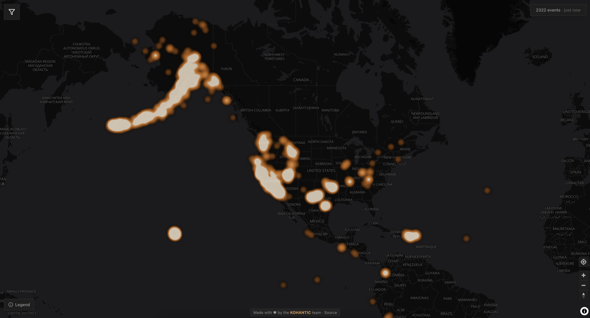

# SentryAtlas

**Real-time disaster monitoring, open and free.**

[](https://github.com/KOHANTIC/SentryAtlas/actions/workflows/ci.yml)
[](LICENSE)


SentryAtlas aggregates live disaster data from four trusted public sources and plots it on a single interactive map. Earthquakes, wildfires, floods, storms — see it all at a glance.

**[sentryatlas.com](https://sentryatlas.com)** · **[Open the map](https://map.sentryatlas.com)**



## Architecture

Three components, deployed as two DigitalOcean apps:

```
   sentryatlas.com                     map.sentryatlas.com
        │                                      │
   ┌────┴─────┐                    ┌───────────┴───────────┐
   │ Landing  │                    │ Frontend  │  /api ──▶ │ Backend
   │ (static) │                    │ (Next.js) │           │  (Go)
   └──────────┘                    └───────────┴───────────┘
                                                     │
                        ┌───────────┬───────────┬────┴──────┐
                        │   USGS    │   EONET   │   NOAA    │  GDACS
                        │           │           │   /NWS    │
                        └───────────┴───────────┴───────────┘
```

- **Backend** — Go API that fetches from 4 upstream sources concurrently, caches per source in memory, and serves a unified `/api/v1/events` endpoint as GeoJSON, flat JSON, or a Server-Sent Events stream
- **Frontend** — Next.js app with MapLibre GL for interactive map rendering, filtering by event type, time range, and viewport
- **Landing** — Static marketing site built with Next.js (`output: "export"`)

## Quick Start

### Prerequisites

- Go 1.25+
- Node.js 22+

### 1. Backend

```bash
cd backend
cp .env.example .env
go mod download
go run ./cmd/server/
# Server starts on http://localhost:8080
```

### 2. Frontend

```bash
cd frontend
cp .env.example .env.local
npm install
npm run dev
# App starts on http://localhost:3000
```

### 3. Landing

```bash
cd landing
npm install
npm run dev -- --port 3002
# Landing page starts on http://localhost:3002
# (both Next.js apps default to port 3000 — give one of them another port)
```

## Project Structure

```
sentryatlas/
├── backend/                 # Go API server
│   ├── cmd/server/          # Entry point
│   ├── internal/
│   │   ├── adapters/        # USGS, EONET, NOAA, GDACS integrations
│   │   ├── cache/           # Generic in-memory TTL cache
│   │   ├── handler/         # HTTP handler and query parsing
│   │   ├── models/          # Unified Event model, event-type registry
│   │   └── service/         # Fan-out orchestration
│   └── Dockerfile
├── frontend/                # Next.js map application
│   ├── src/
│   │   ├── app/             # App router pages
│   │   ├── components/      # MapView, FilterPanel, Legend
│   │   ├── hooks/           # Data fetching hooks
│   │   └── lib/             # API client, types, map styles
│   └── Dockerfile
├── landing/                 # Static landing page
│   └── src/app/             # Single-page marketing site
├── .do/                     # DigitalOcean App Platform specs
│   ├── app.yaml             # Backend + frontend (map.sentryatlas.com)
│   └── landing.yaml         # Landing site (sentryatlas.com)
└── .github/                 # CI workflow, issue & PR templates
```

## API

The backend exposes a single endpoint. See [`backend/README.md`](backend/README.md) for full documentation.

### `GET /api/v1/events`

Returns disaster events from all sources, merged and sorted by date (newest first).

| Param | Type | Description |
|-------|------|-------------|
| `types` | string | Comma-separated event types to include. Unknown values are rejected with a 400. |
| `bbox` | string | Bounding box: `minLon,minLat,maxLon,maxLat`. Events with no coordinates are excluded. |
| `since` | string | Only events after this date (RFC 3339 or `YYYY-MM-DD`) |
| `limit` | int | Max events to return. Defaults to 500, capped at 1000. |
| `format` | string | `geojson` (default), `json`, or `sse` |

**Event types:** `earthquake`, `wildfire`, `volcano`, `storm`, `flood`, `cyclone`, `tornado`, `hurricane`, `winter_storm`, `tsunami`, `drought`, `iceberg`, `landslide`, `weather`, `other`

`weather` is the NOAA fallback for alerts with no more specific class; `other` covers upstream categories no adapter maps yet.

Every response reports the status of each upstream source, so a partial result is distinguishable from a complete one. If **all** relevant sources fail, the API returns `502` rather than an empty success.

**`format=sse`** streams one `event: features` frame per source as it arrives — this is what the map uses, so the first events appear without waiting for the slowest provider — then a terminal `event: done` frame carrying the total and per-source statuses.

Events without coordinates (common for NOAA alerts covering a named region) are returned with `"geometry": null` rather than being placed at 0,0.

## Data Sources

| Source | Data | URL |
|--------|------|-----|
| USGS | Earthquakes | [earthquake.usgs.gov](https://earthquake.usgs.gov) |
| NASA EONET | Wildfires, volcanoes, storms, icebergs | [eonet.gsfc.nasa.gov](https://eonet.gsfc.nasa.gov) |
| NOAA / NWS | Floods, tornadoes, hurricanes, winter storms | [weather.gov](https://www.weather.gov) |
| GDACS | Cyclones, droughts, floods, volcanoes, earthquakes | [gdacs.org](https://www.gdacs.org) |

All four are public and keyless — SentryAtlas holds no API keys and stores no user data.

## Deployment

### Docker

```bash
# Backend
docker build -t sentryatlas-backend ./backend
docker run -p 8080:8080 sentryatlas-backend

# Frontend
docker build --build-arg NEXT_PUBLIC_API_URL=http://localhost:8080 -t sentryatlas-frontend ./frontend
docker run -p 3000:3000 sentryatlas-frontend
```

### DigitalOcean App Platform

Two apps, one spec each:

```bash
doctl apps create --spec .do/app.yaml       # backend + frontend
doctl apps create --spec .do/landing.yaml   # landing site
```

Both specs set `deploy_on_push` on `main`, so a merge deploys.

## Contributing

Contributions are welcome! See [`CONTRIBUTING.md`](CONTRIBUTING.md) for guidelines, and [`SECURITY.md`](SECURITY.md) for reporting vulnerabilities.

## License

This project is licensed under the [GNU Affero General Public License v3.0](LICENSE).

---

Made by the [KOHANTIC](https://kohantic.com) team.
